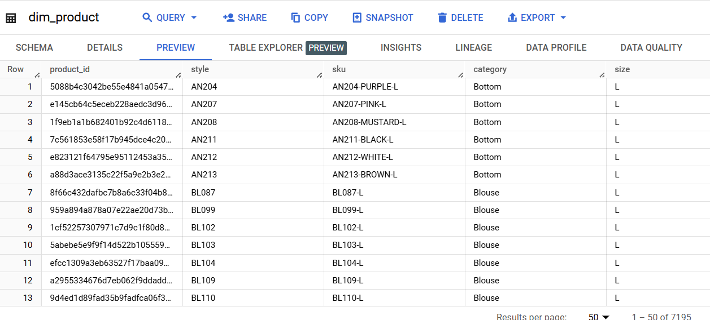
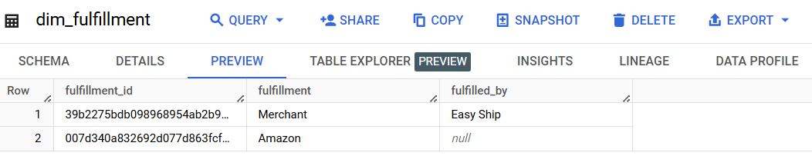
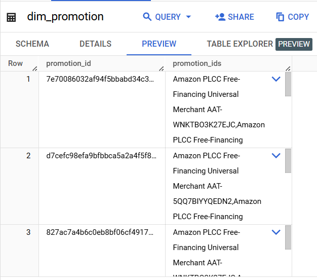
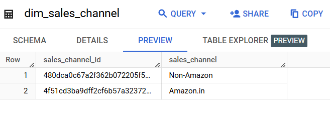
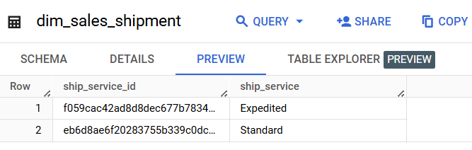
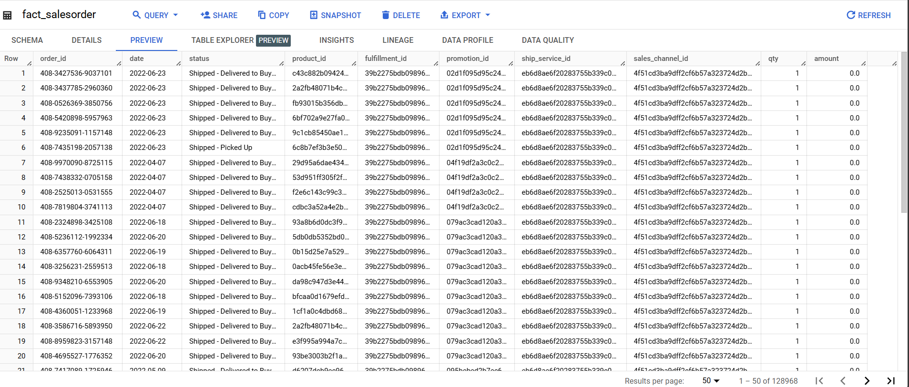
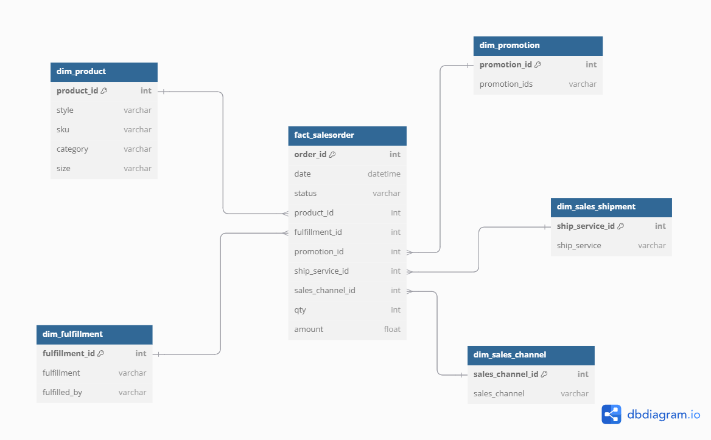
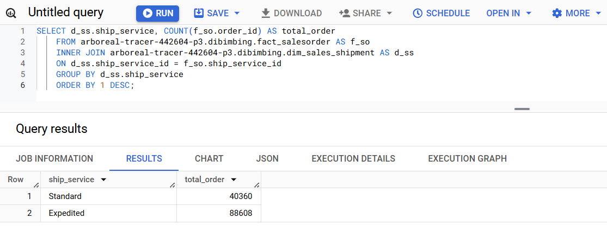

# Day 9 Assignment - Data Warehouse Modeling

This repository contains a project from the Day 9 - Data Warehouse Modeling assignment. It consists of three parts: the ERD (Entity Relationship Diagram) for the data warehouse, the tables that have been created, and the results of the analytical queries performed on the data warehouse.

1. Tables
##### a. dim_product

##### b. dim_fulfillment

##### c. dim_promotion

##### d. dim_sales_channel

##### e. dim_sales_shipment

###### f. fact_salesorder

###
2. ERD Diagram

####
3. Query analytical
- the most favorable shipment type
  
- top product category selling by each month
.png)
.png)
